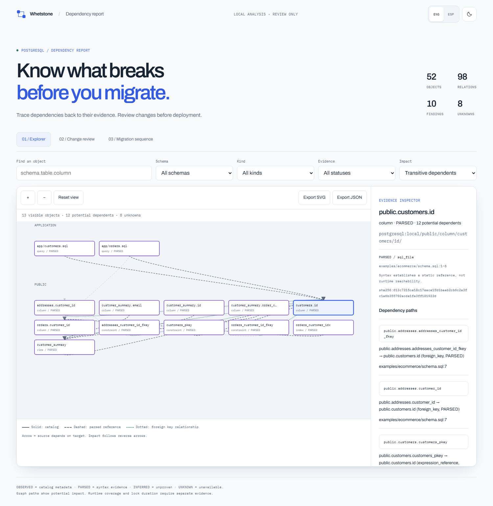

# Database dependency migration

A PostgreSQL dependency and migration-review skill for AI coding agents, with an independent Node.js toolkit. Inspect a schema, trace downstream consumers, and review a proposed change using evidence from SQL files or supplied catalog snapshots. The toolkit never applies migrations.

The versioned `*.dbdep.json` model is the source of truth for validation, findings, interactive HTML, Markdown, Mermaid and DOT. Its canonical contract is **1.0.0**. The current package version is **v0.3.2**. Installing from the repository uses its current `main` source; release tags remain immutable. Local checks do not establish a deployed website or passing remote CI.

## What it does

- Parses common PostgreSQL DDL and simple SQL references with PostgreSQL 18's WebAssembly parser, preserving identifiers, file locations and source hashes.
- Shows table and column dependencies, reverse impact paths, cycles, and distinct foreign-key relationships in a standalone offline HTML explorer.
- Reviews fifteen migration hazard rules, transaction context, conditional rewrite/locking risks, and optional risk-policy gates. Phase plans remain review checklists.
- Compares schema snapshots and marks possible renames as UNKNOWN.
- Reads supplied catalog captures, or performs explicitly requested live discovery with fixed read-only catalog queries. Business rows and routine bodies are not captured.
- Separates OBSERVED metadata, PARSED syntax, INFERRED hypotheses and UNKNOWN gaps. `source -> target` means source depends on target; blast radius follows reverse edges.

The website and report controls support English and Spanish, light/dark themes, and reduced motion. CLI output, Markdown and generated analytical explanations are English. Source names and evidence retain their original language.

## Requirements

- An agent that supports `SKILL.md`, such as Codex or Claude Code, when using the skill. The CLI also works independently.
- Node.js **22.18+** for the toolkit and pnpm **12.10.1**. The pinned [Skills CLI 1.7.2](https://github.com/vercel-labs/skills/blob/main/package.json) requires Node.js **22.20+**; current local validation uses Node.js 24.
- PostgreSQL tools/server only for live discovery or isolated live tests. Offline analysis needs no database server.

Runtime dependencies are locked: `libpg-query`, Ajv, Commander, `pg` and `pg-connection-string`. Python is not a toolkit or development dependency. External skill-creator tooling and historical evaluation baselines may use their own Python runtime. PostgreSQL 18 supplies the parser grammar; catalog and release-aware review context support PostgreSQL 14-18, with partial coverage.

## Installation

### Skills CLI

After the fixed source has been pushed, install from the existing repository with the [Skills CLI](https://www.skills.sh/docs/cli):

```sh
npx skills@1.7.2 add whetstone-dev/Database-Dependency-Migration-Visualizer --skill database-dependency-migration --agent codex --copy
```

This installs into the current project's `.agents/skills/database-dependency-migration`. Replace `codex` with `claude-code` for `.claude/skills/`, or add `--global` for the corresponding personal skill directory. Reload your agent after installation.

Inside the installed skill directory, install the complete runtime:

```sh
pnpm install --prod --frozen-lockfile --ignore-workspace --ignore-scripts
node scripts/dbdep.mjs doctor --json
```

Skills CLI copies the repository directory containing the root `SKILL.md`, including development files, the website and evaluations. The separately packaged `.skill` archive excludes the website and evaluation records. Production installation installs only toolkit dependencies. The pinned install smoke checks the actual Skills CLI path; `workload-profile.json` avoids its exclusion of files named `metadata.json`.

### Manual installation

Clone into an agent's skill directory. For a Codex project, run from the project root:

```sh
git clone https://github.com/whetstone-dev/Database-Dependency-Migration-Visualizer.git .agents/skills/database-dependency-migration
```

For a personal Codex skill on macOS/Linux:

```sh
git clone https://github.com/whetstone-dev/Database-Dependency-Migration-Visualizer.git ~/.agents/skills/database-dependency-migration
```

On Windows PowerShell:

```powershell
git clone https://github.com/whetstone-dev/Database-Dependency-Migration-Visualizer.git "$HOME/.agents/skills/database-dependency-migration"
```

For Claude Code, use `.claude/skills/database-dependency-migration` in a project or `~/.claude/skills/database-dependency-migration` personally. An existing checkout or unpacked `.skill` can also be copied or symlinked into these directories. Install runtime dependencies with the production command above and reload the agent.

### Updating

```sh
npx skills@1.7.2 update database-dependency-migration --project
# Personal Skills CLI installation:
npx skills@1.7.2 update database-dependency-migration --global
# Manual Git project installation:
git -C .agents/skills/database-dependency-migration pull --ff-only
```

For a personal/manual installation, use its actual directory with `git -C`. Rerun the frozen production installation after updating. Keep user inputs and generated reports in the user's workspace, outside the installed skill directory.

## Usage

Ask your agent to use `database-dependency-migration` with the actual input paths. Useful requests include:

- "Inspect `schema.sql` and `queries/`. Create a validated dependency model and HTML report, cite source lines, and list unsupported consumers."
- "Review this BIGINT-to-UUID customer-key proposal against the baseline. Explain foreign-key impact and a phased review plan. Do not execute SQL."
- "Use this supplied catalog capture to trace downstream views of `sales.orders.total_amount`. Separate observed dependencies from runtime coverage gaps."
- "Our runner uses one transaction. Review `007.sql` with `workload-profile.json` as user-supplied size/traffic, and explain definite versus conditional hazards."
- "Compare these two snapshots. Report possible renames as unconfirmed and export the changes."

### Standalone `dbdep` toolkit

For a source checkout, install the full workspace and check prerequisites:

```sh
pnpm install --frozen-lockfile --ignore-scripts
pnpm dbdep doctor --json
```

Run from the checkout:

```sh
node scripts/dbdep.mjs inspect --ddl examples/ecommerce/schema.sql --repo examples/ecommerce/app --out out/schema.dbdep.json
node scripts/dbdep.mjs validate out/schema.dbdep.json --strict --json
node scripts/dbdep.mjs render out/schema.dbdep.json --object public.customers.id --out out/dependencies.html
node scripts/dbdep.mjs docs out/schema.dbdep.json --out out/report.md
node scripts/dbdep.mjs impact out/schema.dbdep.json --object public.customers.id --operation alter-type --to uuid --json
node scripts/dbdep.mjs review --baseline out/schema.dbdep.json --migration examples/high-traffic/migrations/007.sql --metadata examples/high-traffic/workload-profile.json --transaction-mode single --out out/review --fail-on high --json
node scripts/dbdep.mjs diff before.dbdep.json after.dbdep.json --out out/diff --json
node scripts/dbdep.mjs mermaid out/schema.dbdep.json --out out/graph.mmd
node scripts/dbdep.mjs dot out/schema.dbdep.json --out out/graph.dot
node scripts/dbdep.mjs inspect --catalog examples/analytics/catalog.json --out out/catalog.dbdep.json
node scripts/dbdep.mjs demo out/demo --json
```

`pnpm dbdep <command>` runs the same entry point. From another working directory, use `node "<skill-directory>/scripts/dbdep.mjs" ...`. A local npm tarball can expose `dbdep` through `npm install -g <package.tgz>`; no published npm package is assumed.

`snapshot` aliases `inspect`. A schema directory contains declarations; it does not replay migrations. Review without a baseline is explicitly partial. Exit **0** means analysis completed, **2** means invalid input/prerequisites, and **3** means a requested policy gate failed. A successful analysis may contain high-risk findings; failed risk gates still write review artifacts.

Live discovery requires an explicit request, an environment variable containing the DSN, and a suitable least-privileged login:

```sh
node scripts/dbdep.mjs inspect --dsn-env DBDEP_DATABASE_URL --mode read-only --out out/live.dbdep.json --capture-out out/catalog.json
```

Connection details are not printed or persisted. Queries use fixed catalog relations/functions, timeouts and a repeatable-read read-only transaction. Read [catalog capture](references/postgres-catalog.md) and the [security boundary](references/security.md) before discovery.

## Curated scenarios

`pnpm dbdep demo out/demo --json` regenerates all three scenarios. Open their HTML reports locally after cloning.

| Scenario                       | What to review                                                                                | Sources and outputs                                                                                                                                                                                                              |
| ------------------------------ | --------------------------------------------------------------------------------------------- | -------------------------------------------------------------------------------------------------------------------------------------------------------------------------------------------------------------------------------- |
| Customer identifier transition | Foreign keys, a summary view and application SQL affected by a BIGINT-to-UUID proposal        | [Schema](examples/ecommerce/schema.sql), [proposal](examples/ecommerce/migrations/003_contract_legacy_id.sql), [HTML](examples/rendered/ecommerce/report.html), [model](examples/rendered/ecommerce/model.dbdep.json)            |
| Chained views                  | Reverse impact through recorded `pg_rewrite` ownership and qualified CASCADE risk             | [Catalog](examples/analytics/catalog.json), [capture provenance](examples/analytics/capture-provenance.json), [HTML](examples/rendered/analytics/report.html), [model](examples/rendered/analytics/model.dbdep.json)             |
| Index and transaction hazards  | Regular-index locking, conditional type rewrite, and concurrent indexing inside a transaction | [Proposal](examples/high-traffic/migrations/007.sql), [user metadata](examples/high-traffic/workload-profile.json), [HTML](examples/rendered/high-traffic/report.html), [model](examples/rendered/high-traffic/model.dbdep.json) |



Screenshots illustrate presentation. Tests and source evidence establish graph behavior. UUID mapping needs operational review; catalog captures do not reveal every runtime consumer; scenario size/traffic is supplied, not measured. See the [example index](examples/README.md).

## Website and GitHub Pages

The separate [Next.js website](site/README.md) exports the home page and bilingual documentation at `/docs/` as static HTML. It retains source-backed examples and links to full standalone reports. It has no upload flow or database connection.

```sh
pnpm build
pnpm preview
```

Open the localhost URL printed by the preview. GitHub Pages deployment is a manual workflow after review and publication; it publishes `site/out`. The build uses the configured Pages base path, including a repository subdirectory. Existing `/#/docs` bookmarks redirect after JavaScript loads. Curated examples and copied documentation become public. Local `out/`, `tmp/` and evaluation directories are not deployed. Follow the [Pages setup and deployment guide](docs/github-pages.md). No live deployment is claimed here.

## Repository layout

| Path                                    | Contents                                                                              |
| --------------------------------------- | ------------------------------------------------------------------------------------- |
| `SKILL.md`, `agents/`                   | Agent entry point, task routing and display metadata                                  |
| `src/dbdep/`                            | Independent model, parser, graph, catalog, hazard, planning, reporting and CLI engine |
| `scripts/dbdep.mjs`                     | Standalone CLI entry point                                                            |
| `scripts/`                              | Fixture, packaging, install-smoke and evaluation development tools                    |
| `schemas/`, `references/`, `templates/` | Canonical schemas, evidence semantics, safety guidance and report template            |
| `assets/viewer/`                        | Offline report viewer and embedded licensed fonts                                     |
| `examples/`                             | Curated inputs, authentic sanitized capture and generated reports                     |
| `tests/`                                | Node, browser and isolated live regressions                                           |
| `site/`                                 | Next.js static website, documentation and license notices                             |
| `evals/`, `docs/`                       | Frozen evaluation evidence, validation, security audit and maintenance guides         |

## Known limitations

- PostgreSQL only. The parser checks syntax, not complete server name/type binding or compatibility across releases.
- Simple SQL references are potential consumers. Nested/CTE column scopes, routine bodies, dynamic SQL and host-language/ORM SQL retain UNKNOWN gaps; there is no exhaustive runtime call graph.
- Backfill/DML semantics, migration replay and target-schema review are partial or unavailable. Missing findings do not establish safety.
- Catalog/repository merging is unavailable. Compare matching capture modes; catalog definition diff is partial. Similar add/drop pairs do not confirm renames.
- Reverse paths do not prove consumer failure or PostgreSQL's exact CASCADE deletion closure. Lock duration, rewrite timing, zero downtime and lossless rollback are not guaranteed.
- Phase plans require change-specific operational review. The viewer shows at most 350 nodes, 40 path previews and 16 steps per preview; CLI paths remain complete. SVG/JSON export is available; PNG export is unavailable.
- Object names and paths can expose sensitive architecture. Provenance and validation are not general secret detectors. Keep reports local unless sharing is requested.

Read [parser coverage](references/parser-and-confidence.md), [dependency semantics](references/dependency-semantics.md), [migration review](references/migrations.md), and the [model contract](references/model.md).

## Validation and contributing

See [CONTRIBUTING.md](CONTRIBUTING.md) for actual pnpm checks, fixture regeneration, installation smoke tests and release conventions. [Security policy](SECURITY.md), [security audit](docs/security-audit.md), [Node validation](docs/node-validation.md) and [release procedure](docs/releases.md) record boundaries and verification. Audit receipts distinguish local results from configured remote checks.

[Evaluation prompts](evals/evals.json), [trigger cases](evals/trigger-queries.json), [retained results](evals/README.md) and the [evaluation method](docs/evaluation.md) preserve actual runs and their limitations. The frozen comparison predates current hardening; it is not proof of production reliability or performance advantage. Human qualitative review and some trigger measurements remain unavailable.

## Design provenance and license

The model/validator/artifact pattern draws on [whetstone-dev/network-engineering](https://github.com/whetstone-dev/network-engineering); standalone typed diagrams and separate visual gates draw on [tt-a1i/archify](https://github.com/tt-a1i/archify). Their engines and assets were not imported. Emil Kowalski's design-engineering guidance informed interaction polish. This PostgreSQL engine is independent.

Original code is [MIT](LICENSE), copyright whetstone-dev. Dependencies retain their own licenses; embedded PostgreSQL code retains upstream notices and embedded fonts retain complete SIL Open Font License notices. The website includes React Bits adaptations under MIT + Commons Clause and GSAP under its Standard License. Read the [toolkit notices](THIRD_PARTY_NOTICES.md) and [website notices](site/THIRD_PARTY_NOTICES.md) before redistribution.
