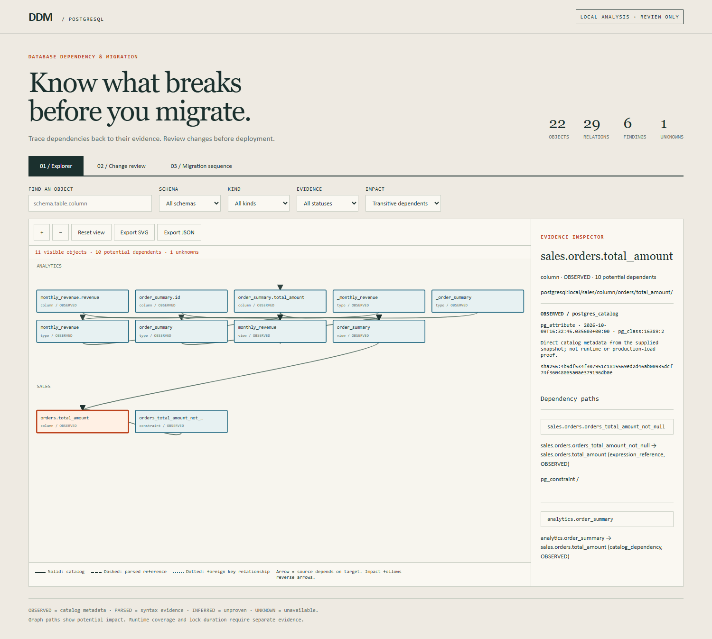
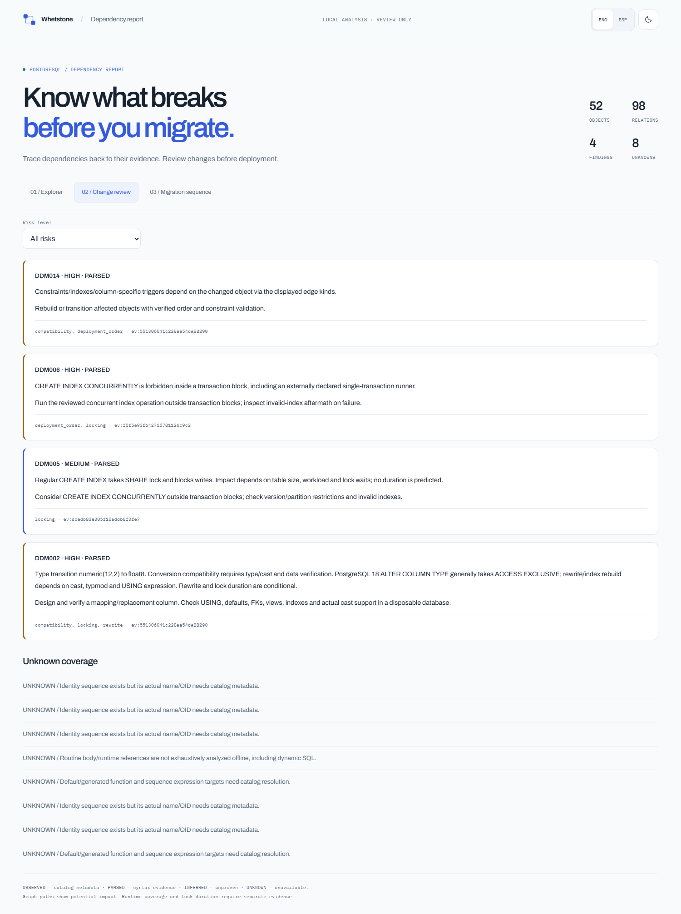

# Database dependency migration

**Know what breaks before you migrate.**

Source-backed PostgreSQL dependency graphs, blast-radius analysis, and review-only migration plans, built for AI coding agents.

This repository implements the `database-dependency-migration` Agent Skill and an independent Node.js toolkit. A versioned `*.dbdep.json` model feeds deterministic validation, risk findings, interactive HTML, Markdown, Mermaid and DOT. All analysis stays local. The toolkit never applies migrations.

## Try the three generated demos

Run `pnpm dbdep demo out/demo` to reproduce the demos from shipped inputs. Generated reports derive from actual CLI executions. Screenshots show presentation; tests establish graph behavior.

| Demo | What it shows | Inputs and artifacts |
|---|---|---|
| Customer identifier transition | FKs, customer summary and app SQL affected by a BIGINT-to-UUID proposal; review-only phase plan | [Schema](examples/ecommerce/schema.sql), [proposal](examples/ecommerce/migrations/003_contract_legacy_id.sql), [model](examples/rendered/ecommerce/model.dbdep.json), [HTML](examples/rendered/ecommerce/report.html), [report](examples/rendered/ecommerce/report.md) |
| Chained views | Reverse impact through real pg_rewrite ownership to both downstream views; qualified CASCADE risk | [Schema](examples/analytics/schema.sql), [catalog](examples/analytics/catalog.json), [model](examples/rendered/analytics/model.dbdep.json), [HTML](examples/rendered/analytics/report.html), [report](examples/rendered/analytics/report.md) |
| Dangerous index proposal | Regular index locking, conditional type rewrite, and forbidden concurrent index in BEGIN/COMMIT | [Migration](examples/high-traffic/migrations/007.sql), [user metadata](examples/high-traffic/metadata.json), [model](examples/rendered/high-traffic/model.dbdep.json), [HTML](examples/rendered/high-traffic/report.html), [report](examples/rendered/high-traffic/report.md) |





Demo limitations: UUID mapping and production deployment require operational review; catalog metadata cannot reveal all runtime consumers; size/traffic in the index scenario is user-supplied, not measured. Read [the example index](examples/README.md).

## Skill webpage

The [React webpage](site/README.md) explains the workflow, installation and evidence boundaries. Its `/#/docs` documentation section has a grouped sidebar, topic cards, installation, quickstart, command reference, and safety guides. Simple example cards open the full interactive reports separately. Both the website and reports use the same light/dark palette, fonts and persistent ENG/ESP controls. GSAP, Lenis and adapted React Bits components supply motion and pointer feedback. Dependencies are pinned in the workspace `pnpm-lock.yaml`; motion respects reduced-motion preferences.

```sh
pnpm install --frozen-lockfile
pnpm build
pnpm preview
```

Open the localhost URL printed by Vite, then select Docs or visit `/#/docs`. [Desktop](site/screenshots/desktop-hero.png), [documentation](site/screenshots/desktop-dark-docs.png), [dark mode](site/screenshots/desktop-dark-hero.png) and [Spanish mobile](site/screenshots/mobile-es-dark-hero.png) screenshots come from the built page. The redesign applies Emil Kowalski's design-engineering and Apple design skills. English is the default. Report UI translates into Spanish; source identifiers, evidence and analytical text retain their original language. CLI and Markdown output remain English. The website has no database connection or upload flow.

## Install

Node.js 22.18+ and pnpm 12.10.1 are required. The complete toolkit uses JavaScript ES modules, PostgreSQL's WASM parser, Ajv and pg. Python is not a runtime or development dependency. Source/parser grammar is PostgreSQL 18; release-aware review/catalog context is PostgreSQL 14-18. CI is configured for 14-18; configured versions and locally tested versions are distinguished in [validation](docs/validation.md).

```sh
pnpm install --frozen-lockfile
pnpm dbdep doctor --json
# Browser development:
pnpm exec playwright install chromium
```

To use this checkout as a skill, install its folder in your agent's skill directory, or point the agent at [SKILL.md](SKILL.md). For Codex, copy/symlink the checkout as `~/.agents/skills/database-dependency-migration` or your project `.agents/skills/database-dependency-migration`. For Claude Code, use `~/.claude/skills/database-dependency-migration` or `.claude/skills/database-dependency-migration`. Restart/reload your agent after installation. An unpacked skill installs its runtime with `pnpm install --prod --frozen-lockfile --ignore-workspace` in the skill folder. A local npm tarball can also be installed with `npm install -g <package.tgz>` to expose `dbdep`.

After this implementation has been pushed to the existing repository, the remote installer command is:

```sh
npx skills add https://github.com/whetstone-dev/Database-Dependency-Migration-Visualizer
```

Remote publication is separate from local implementation. The brief's proposed `whetstone-dev/database-dependency-migration` URL is not advertised as an existing release.

## CLI

```sh
dbdep inspect --ddl examples/ecommerce/schema.sql --repo examples/ecommerce/app --out out/ecommerce.dbdep.json
dbdep validate out/ecommerce.dbdep.json --strict --json
dbdep render out/ecommerce.dbdep.json --object public.customers.id --out out/dependencies.html
dbdep docs out/ecommerce.dbdep.json --out out/report.md
dbdep impact out/ecommerce.dbdep.json --object public.customers.id --operation alter-type --to uuid --json
dbdep review --baseline out/ecommerce.dbdep.json --migration examples/high-traffic/migrations/007.sql --out out/review --fail-on high --json
dbdep diff before.dbdep.json after.dbdep.json --out out/diff --json
dbdep mermaid out/ecommerce.dbdep.json --out out/graph.mmd
dbdep dot out/ecommerce.dbdep.json --out out/graph.dot
dbdep inspect --catalog examples/analytics/catalog.json --out out/analytics.dbdep.json
dbdep demo out/demo
dbdep doctor --json
```

In a checkout, prefix these commands with `pnpm`, or run `node scripts/dbdep.mjs <command>`. `snapshot` aliases `inspect`. `inspect --ddl` accepts a file or directory of schema declarations, not migration replay. `review` without baseline is allowed and explicitly partial. Use `--transaction-mode single` if the runner wraps SQL in one transaction. `--metadata examples/high-traffic/metadata.json` labels scenario statistics as user-supplied.

Exit 0 means completed analysis, which may contain high-risk findings. Exit 2 means invalid data/prerequisites/unsupported command. Exit 3 means an explicitly requested risk policy failed; review artifacts still exist. `--fail-on medium` gates high/medium, and `--fail-on unknown` gates high/medium/unknown.

For explicitly requested live discovery, supply a DSN through an environment variable and a least-privileged role:

```sh
dbdep inspect --dsn-env DBDEP_DATABASE_URL --mode read-only --out out/live.dbdep.json --capture-out out/catalog.json
```

The CLI does not print/store the DSN. It uses fixed SELECTs, timeouts and repeatable-read read-only snapshots; no business rows or arbitrary routines. See [catalog capture](references/postgres-catalog.md) and [security](references/security.md).

## Implemented coverage and limits

| Capability | v0.3.1 status |
|---|---|
| Canonical schema, deterministic IDs/order, referential/hash validation | Implemented and tested |
| Common PostgreSQL DDL, quoted identifiers, composite keys, routine overload identity | Implemented; unsupported statements produce UNKNOWN |
| Simple SQL table/column references and reverse impact paths/cycles | Implemented; static references are potential consumers |
| DDM001-DDM015, transaction context, phase plan and risk policy | Implemented with positive/negative fixtures; operational outcomes remain conditional |
| Offline HTML, schema/kind/status search, reverse highlights, paths, risk/phase tabs | Implemented and browser-tested; 350 visible nodes, 40 path previews, 16 steps per preview; CLI paths remain complete |
| SVG/JSON browser export, Markdown/Mermaid/DOT CLI export | Implemented; PNG export is unavailable |
| Real catalog capture and pg_rewrite owner normalization | Implemented; recorded metadata only |
| Snapshot diff and possible-rename diagnostics | Implemented; no confirmed rename inference |
| DML/backfill semantics, migration replay, target-schema review | Partial or unavailable; DML reviews report UNKNOWN |
| Nested/CTE column scope, routine bodies/dynamic SQL, ORM/host-language SQL | UNKNOWN coverage; no exhaustive runtime call graph |
| Catalog plus repository merge; full catalog definition diff | Unavailable/partial; compare like capture modes |
| Exact CASCADE deletion closure, physical rewrite timing, production downtime | Unavailable; no operational guarantees |
| Other database engines or migration execution | Outside scope |

Phase plans are a generic review checklist, not executable target-specific migrations. Use only the phases relevant to the proposed change and verify data transformations, consumer ownership and operational prerequisites independently.

Arrows mean **source depends on/references target**. Impact follows reverse edges. FK relationships, catalog dependencies and parsed SQL references are distinct. OBSERVED means supplied catalog metadata, PARSED means AST evidence, INFERRED means unproven, and UNKNOWN means missing/unsupported. See [model](references/model.md) and [dependency semantics](references/dependency-semantics.md).

## Validate and evaluate

```sh
pnpm test
pnpm build
pnpm test:browser
pnpm test:live
pnpm benchmark
pnpm verify:examples
pnpm pack --pack-destination dist/v0.3.1
pnpm package:skill
pnpm package:site
pnpm smoke:artifacts
```

Unit tests need no server. Browser tests need installed Chromium. Live integration uses a dedicated disposable fixture database only; `scripts/fixture-cluster.mjs` creates its own local cluster and stops it on completion. Supply `--pg-bin <directory>` if PostgreSQL tools are absent from PATH; Windows also detects PostgreSQL 18's standard installation path. CI provisions PostgreSQL versions separately. [Evaluation prompts](evals/evals.json), [trigger cases](evals/trigger-queries.json) and [evaluation results](evals/README.md) distinguish actual paired runs from unavailable creator steps. The separately installed creator owns its evaluation scripts and may use Python; that does not add a Python dependency to this toolkit. No CI badge or hosted release is claimed before publication.

## Design provenance and license

The model-to-validator-to-artifacts pattern adapts [whetstone-dev/network-engineering](https://github.com/whetstone-dev/network-engineering); typed standalone diagrams and separate visual gates draw from [tt-a1i/archify](https://github.com/tt-a1i/archify). Their engines/assets were not imported. Viewer interaction polish applies the installed [Emil Kowalski design-engineering skill](https://github.com/emilkowalski/skills). This PostgreSQL engine is independent. Existing tools such as Atlas and Bytebase overlap in schema review/diff/ERD workflows; this tool focuses on local evidence and qualified cross-layer impact, not universal feature superiority.

Original toolkit code is [MIT](LICENSE). Dependencies retain their own licenses; the libpg-query JavaScript wrapper uses MIT and embedded PostgreSQL code retains its upstream notices. Embedded fonts retain their complete SIL Open Font License notices in reports and packages. The webpage contains React Bits adaptations under MIT + Commons Clause and uses GSAP's Standard License. See [third-party notices](THIRD_PARTY_NOTICES.md) and [webpage notices](site/THIRD_PARTY_NOTICES.md) before redistributing. [Security](SECURITY.md), [contributing](CONTRIBUTING.md) and [release procedure](docs/releases.md) describe maintenance.
